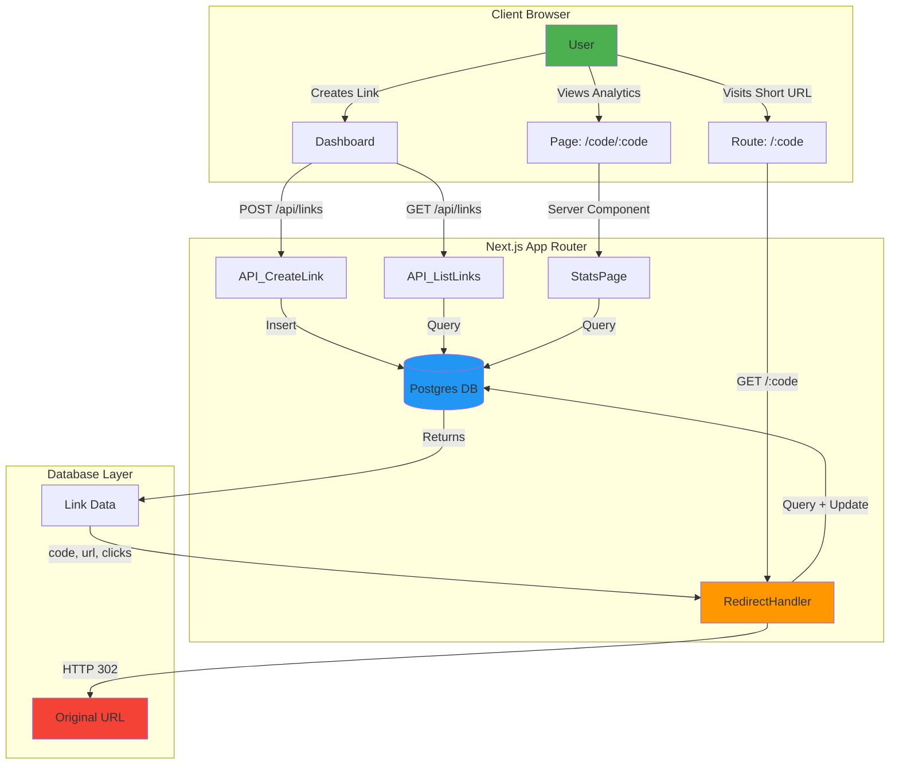

# 🔗 TinyLink

A modern, production-ready URL shortener built with Next.js 16, TypeScript, and Vercel Postgres. Create short, memorable links and track their performance with detailed analytics.

**Live Demo:** [https://tinylink-kappa-sandy.vercel.app](https://tinylink-kappa-sandy.vercel.app)

[](https://nextjs.org)
[](https://www.typescriptlang.org)
[](https://vercel.com)

---

## ✨ Features

- **🎯 Short Link Generation**: Auto-generated 6-8 character alphanumeric codes
- **✏️ Custom Codes**: Create memorable, branded short links
- **📊 Click Analytics**: Track clicks, timestamps, and link performance
- **⚡ Real-time Updates**: Instant feedback with toast notifications
- **📱 Responsive Design**: Beautiful UI powered by shadcn/ui and Tailwind CSS
- **🔒 Duplicate Prevention**: HTTP 409 status for existing codes
- **🗑️ Link Management**: Delete links with confirmation dialogs
- **🎨 Modern UI**: Component-based architecture with loading states and animations

---

## 🏗️ Architecture



### How It Works

1. **Link Creation**
   - User submits a URL (with optional custom code)
   - API validates input using Zod schemas
   - Database stores link with unique code constraint
   - Returns short link: `domain.com/{code}`

2. **Redirection Flow**
   - User visits `/:code`
   - Server queries database for the code
   - Increments click counter and updates timestamp
   - Returns HTTP 302 redirect to original URL

3. **Analytics**
   - Each click updates `clicks` count and `last_clicked_at`
   - Stats page displays metrics with visual cards
   - Real-time data fetching via Server Components

---

## 🚀 Quick Start

### Prerequisites

- Node.js 18+ and npm
- PostgreSQL database (Vercel Postgres/Neon recommended)

### Installation

```bash
# Clone the repository
git clone https://github.com/rajdesai17/tinylink.git
cd tinylink

# Install dependencies
npm install

# Set up environment variables
cp .env.example .env.local
# Edit .env.local with your database credentials
```

### Environment Variables

Create a `.env.local` file with:

```env
# Vercel Postgres (from Vercel Dashboard)
POSTGRES_URL="postgres://..."
POSTGRES_PRISMA_URL="postgres://..."
POSTGRES_URL_NON_POOLING="postgres://..."

# Base URL for your app
BASE_URL="http://localhost:3000"
```

### Database Setup

```bash
# Run the schema migration
psql $POSTGRES_URL_NON_POOLING -f schema.sql
```

### Development

```bash
npm run dev
```

Open [http://localhost:3000](http://localhost:3000) to see the app.

---

## 📁 Project Structure

```
tinylink/
├── app/                      # Next.js 16 App Router
│   ├── api/
│   │   └── links/           # REST API routes
│   │       ├── route.ts     # POST /api/links, GET /api/links
│   │       └── [code]/route.ts  # GET, DELETE /api/links/:code
│   ├── code/[code]/page.tsx # Stats page (Server Component)
│   ├── [code]/route.ts      # Redirect handler (/:code → 302)
│   ├── healthz/route.ts     # Health check endpoint
│   ├── page.tsx             # Dashboard (Client Component)
│   ├── layout.tsx           # Root layout with fonts & toast
│   └── globals.css          # Tailwind CSS config
├── components/
│   ├── ui/                  # shadcn/ui primitives
│   ├── AddLinkForm.tsx      # Link creation form (React Hook Form)
│   ├── LinkTable.tsx        # Data table with actions
│   ├── Header.tsx           # Navigation header
│   └── CopyButton.tsx       # Copy-to-clipboard button
├── lib/
│   ├── db.ts               # Database queries (@vercel/postgres)
│   ├── validations.ts      # Zod schemas
│   └── utils.ts            # Utility functions
├── schema.sql              # PostgreSQL table schema
└── README.md
```

---

## 🛠️ Tech Stack

| Category | Technology |
|----------|-----------|
| **Framework** | [Next.js 16](https://nextjs.org) (App Router, Turbopack) |
| **Language** | [TypeScript 5](https://www.typescriptlang.org) |
| **Database** | [Vercel Postgres](https://vercel.com/storage/postgres) (Neon) |
| **Styling** | [Tailwind CSS 4](https://tailwindcss.com) |
| **UI Components** | [shadcn/ui](https://ui.shadcn.com) (Radix UI) |
| **Forms** | [React Hook Form](https://react-hook-form.com) + [Zod](https://zod.dev) |
| **Icons** | [Lucide React](https://lucide.dev) |
| **Notifications** | [Sonner](https://sonner.emilkowal.ski) |
| **Deployment** | [Vercel](https://vercel.com) |

---

## 📡 API Reference

### `POST /api/links`

Create a new short link.

**Request Body:**

```json
{
  "url": "https://example.com/very/long/url",
  "code": "custom"
}
```

**Response (201):**

```json
{
  "code": "custom",
  "url": "https://example.com/very/long/url",
  "clicks": 0,
  "created_at": "2025-11-21T10:30:00Z"
}
```

**Error (409):** Code already exists

---

### `GET /api/links`

Retrieve all links.

**Response (200):**

```json
{
  "links": [
    {
      "code": "abc123",
      "url": "https://example.com",
      "clicks": 42,
      "last_clicked_at": "2025-11-21T12:00:00Z",
      "created_at": "2025-11-20T08:00:00Z"
    }
  ]
}
```

---

### `GET /api/links/:code`

Get details for a specific link.

---

### `DELETE /api/links/:code`

Delete a link permanently.

---

### `GET /:code`

Redirect to the original URL (HTTP 302). Increments click counter.

---

### `GET /healthz`

Health check endpoint.

**Response (200):**

```json
{
  "ok": true,
  "version": "1.0"
}
```

---

## 🎨 UI Components

Built with **shadcn/ui** for a modern, accessible experience:

- ✅ **Button**: Primary actions with loading states
- ✅ **Card**: Content containers with headers
- ✅ **Form**: Validated inputs with error messages
- ✅ **Table**: Responsive data grid with sorting
- ✅ **Dropdown Menu**: Context menus for actions
- ✅ **Alert Dialog**: Confirmation modals
- ✅ **Skeleton**: Loading placeholders
- ✅ **Toast**: Success/error notifications

---

## 🧪 Testing

```bash
# Build production bundle
npm run build

# Lint code
npm run lint

# Type checking
npx tsc --noEmit
```

### Manual Testing Checklist

- [x] Create link with auto-generated code → Returns 201
- [x] Create link with custom code (6-8 chars) → Returns 201
- [x] Duplicate code → Returns 409
- [x] Redirect `/:code` → Returns 302, increments clicks
- [x] Stats page `/code/:code` → Displays analytics
- [x] Delete link → Returns success, subsequent redirect returns 404
- [x] Health endpoint `/healthz` → Returns `{ ok: true }`

---

## 🚢 Deployment

### Deploy to Vercel

1. Push to GitHub:

   ```bash
   git add .
   git commit -m "feat: initial commit"
   git push origin main
   ```

2. Connect repository to Vercel:
   - Go to [vercel.com/new](https://vercel.com/new)
   - Import your GitHub repository
   - Vercel auto-detects Next.js configuration

3. Add environment variables in Vercel Dashboard:
   - `POSTGRES_URL`
   - `POSTGRES_PRISMA_URL`
   - `POSTGRES_URL_NON_POOLING`
   - `BASE_URL` (set to your production domain)

4. Deploy! Vercel will build and deploy automatically.

### Post-Deployment

Update `BASE_URL` in Vercel to match your production URL:

```env
BASE_URL="https://your-domain.vercel.app"
```

---

## 📝 License

MIT License - See [LICENSE](LICENSE) for details.

---

## 🤝 Contributing

Contributions are welcome! Please open an issue or submit a pull request.

---

## 📧 Contact

**Developer:** Raj Desai  
**Repository:** [github.com/rajdesai17/tinylink](https://github.com/rajdesai17/tinylink)  
**Live App:** [tinylink-kappa-sandy.vercel.app](https://tinylink-kappa-sandy.vercel.app)

---

Built with ❤️ using Next.js 16 and shadcn/ui

